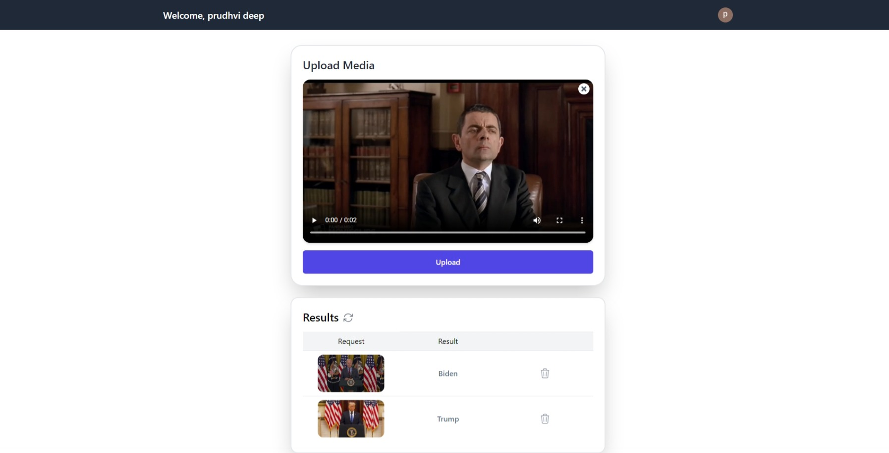

# Video Face Recognition

In this project, I built an elastic application that can scale out and on-demand to process and detect faces in a video. I achieved this using the PaaS offerings from AWS - specifically AWS Lambda and other supporting services from AWS.

**Try the live Version ---->** https://main.d2g4ycz7ogc8gz.amplifyapp.com/

## Description

In this section, I'll describe the main components of this application.

### Frontend

The front end is built using **React.js** and styled with **TailwindCss**. The application is secured with **Firebase Authentication**.
<p align="center">
  
</p>

<p align="center">
  
</p>

### Backend

Our video analysis application uses four Lambda functions to implement a multi-stage pipeline to process videos sent by users.

- The pipeline starts with a user uploading a video to the input bucket.
- ***video-splitting function*** splits the video into frames and chunks them into the group-of-pictures (GoP) using FFmpeg. It stores this group of pictures in an intermediate stage-1 bucket.
- ***face-recognition function*** extracts the faces in the pictures using a Single Shot MultiBox Detector (SSD) algorithm and uses only the frames with faces for face recognition. It uses a pre-trained CNN model (ResNet-34) for face recognition and outputs the name of the extracted face. The final output is stored in the output bucket.

The structure of the application is shown in the figure below. I used AWS Lambda for serverless computation and S3 for storing the data required for the functions.

<p align="center">
  
</p>

## Setup

### Clone the repository

```
git clone git@github.com:prudhvideep/Video-Face-Recognition.git && cd Video-Face-Recognition/
```

### Prerequisites

- Terraform CLI (1.2.0+)
- Aws CLI installed.
- npm
- AWS account and associated credentials.

### Infrastructure

Execute the script **setup_infrastructure.sh** to install the prerequisites and initialize the infrastructure in AWS (***using terraform*** )

```
chmod +X ./scripts/setup_infrastructure.sh && sh ./scripts/setup_infrastructure.sh
```
This script initializes the infrastructure and outputs the necessary lambda function urls.
<br>
<br>
To teardown the infrastructure, execute

```
chmod +X ./scripts/destroy_infrastructure.sh && sh ./scripts/destroy_infrastructure.sh
```

### Firebase

Create a Firebase project, set the authentication with email, and add the Gmail provider to implement sign-in with Gmail.

- **References**: please refer this article [Firebase Authentication](https://medium.com/@Adekola_Olawale/firebase-authentication-413626c5234d).

### Environment Variables

setup a .env file
```
touch .env
```
Update the following environment variables

```
#firebase keys
REACT_APP_FIREBASE_API_KEY ="<<Your Key>>"
REACT_APP_AUTH_DOMAIN = "<<Your Key>>"
REACT_APP_PROJECT_ID = "<<Your Key>>"
REACT_APP_STORAGE_BUCKET = "<<Your Key>>"
REACT_APP_MESSAGING_SENDER_ID = "<<Your Key>>"

#Aws keys
REACT_APP_S3_BUCKET_INPUT = "<<Your Key>>"
REACT_APP_S3_BUCKET_OUTPUT = "<<Your Key>>"
REACT_APP_PRESIGNED_LAMBDA_URL = "<<Your Key>>"
REACT_APP_OUTPUT_LAMBDA_URL = "<<Your Key>>"
REACT_APP_DELETE_LAMBDA_URL = "<<Your Key>>"
```

### Start React Application
Install the project dependencies by running:

```
npm install
```

Start the development server

```
npm start
```
To build the production application, run the following:

```
npm run build
```

### Upcoming Features

- Standard Logging.
- Support for multiple media types.
- Detecting videos with multiple characters.